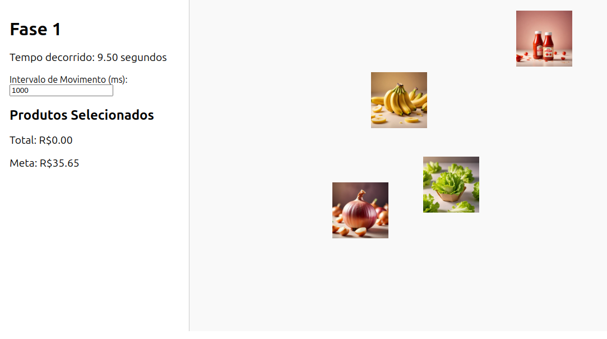
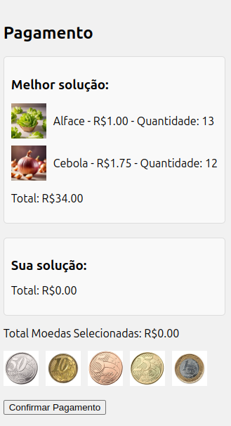
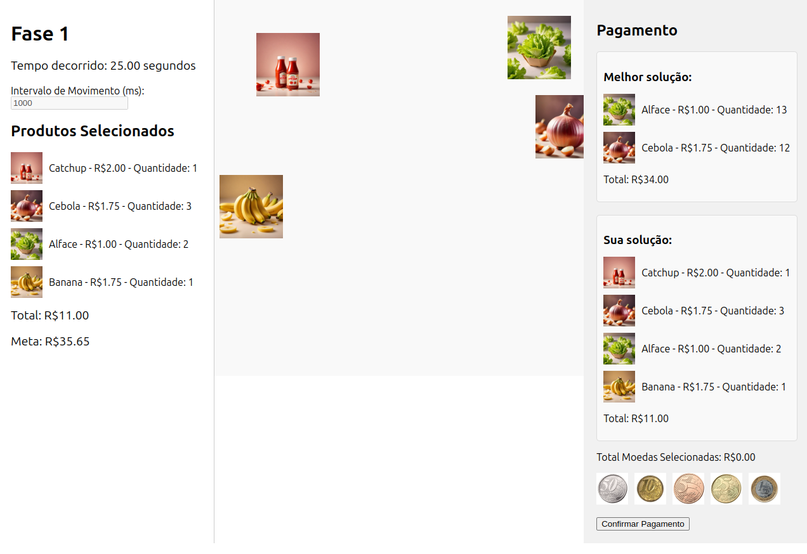

# Supermarket Product Selection Game

## Temas:
 - Algoritmos ambiciosos

## Alunos
| Matrícula | Aluno |
| --------- | ----- |
| 19/0048760  | Wellington Jonathan de Souza Rodrigues |
| 20/2063346  | José Filipi Brito Souza |

## Sobre 
Este projeto implementa um jogo interativo onde o usuário deve selecionar produtos de supermercado com base em um orçamento definido. Os produtos se movem na tela, e o usuário deve clicar neles para adicioná-los ao carrinho. Quando o orçamento é atingido ou o tempo acaba, o usuário deve selecionar as moedas para confirmar o pagamento, utilizando um algoritmo ambicioso para determinar a melhor combinação possível de moedas para o pagamento, bem como é apresentado qual seria os produtos e as suas quantidades selecionados pelo algoritimo ambicioso.

## Screenshots
### Tela Inicial do Jogo


### Tela de Pagamento


### Aplicação completa



## Instalação 
**Linguagem**: Python 3.x, JavaScript (React)<br>
**Framework**: Flask, React<br>

### Pré-requisitos
Certifique-se de ter as seguintes ferramentas instaladas:

- Python 3.x (https://www.python.org/downloads/)
- Flask & Flask-CORS
- React (utilizando `create-react-app`)
- Axios para requisições HTTP

### Comandos de Instalação

1. Clone o repositório do projeto:

```bash
git clone https://github.com/seu-usuario/seu-repositorio.git
cd seu-repositorio
chmod +x install.sh
./install.sh

```

## Vídeo da apresentação
